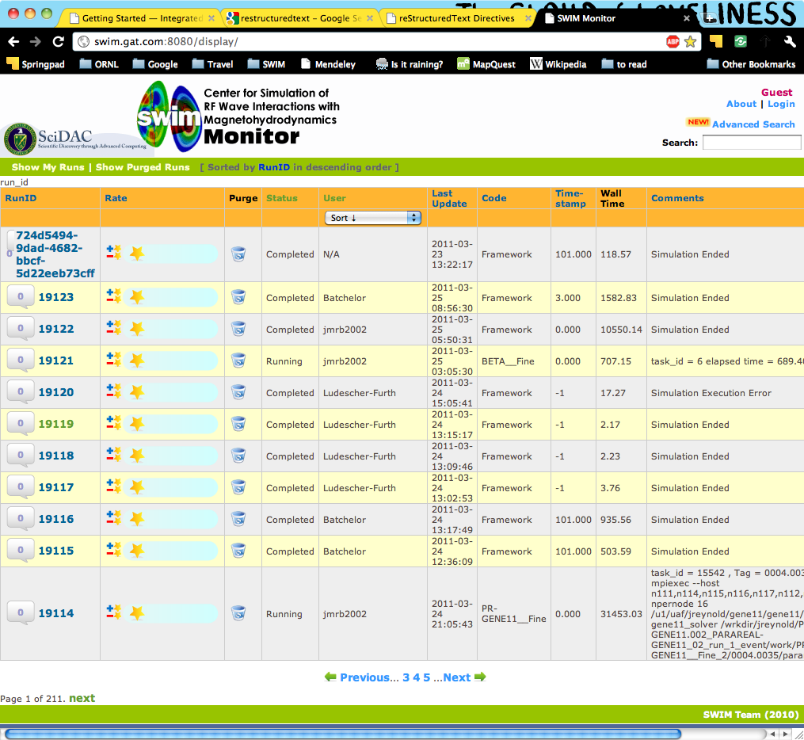
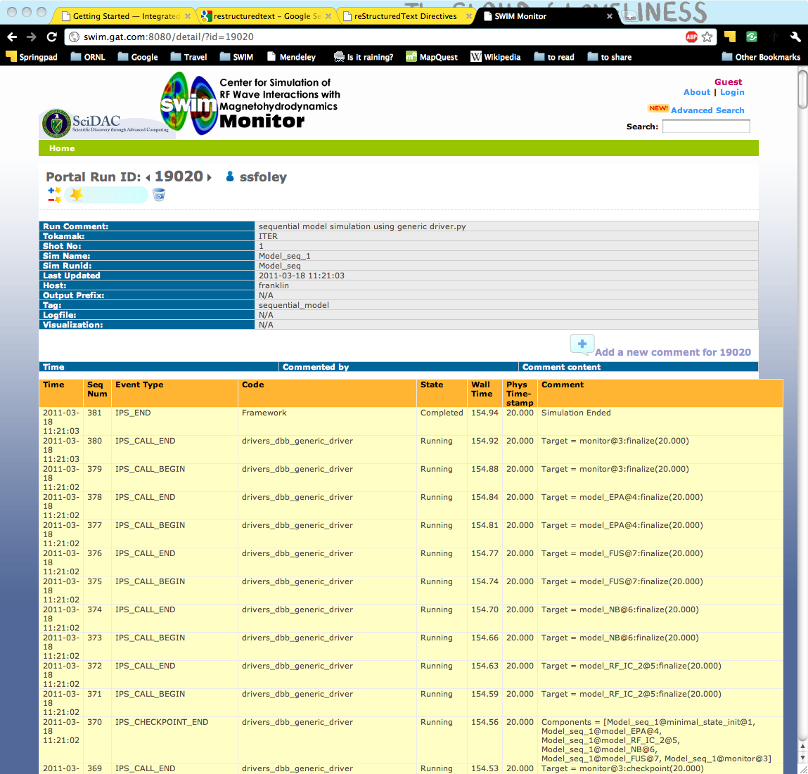
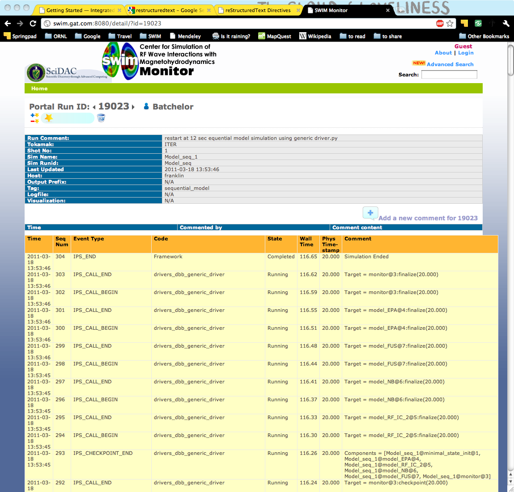

Getting Started
===============

This document will guide you through the process of running an IPS simulation and describe the overall structure of the IPS.  It is designed to help you build and run your first IPS simulation.  It will serve as a tutorial on how to get, build, and run your first IPS simulation, but not serve as a general reference for constructing and running IPS simulations.  See the :doc:`Basic User Guides<../user_guides/user_guides>` for a handy reference on running and constructing simulations in general, and for more in-depth explanations of how and why the IPS works.

======================================
Obtaining, Dependencies, Platforms
======================================

The IPS code is currently located in the SWIM project's Subversion (SVN) repository.  In order to checkout a copy, you must have SVN installed on the machine you will be using and be given permission to check out the IPS from the SWIM project.  (SVN is installed on the machines used in the examples below.)  See the SWIM project's website for details and instructions on how to sign up.

Once you have permission to access the repository, replace <cswim_user> with your user name and check out the IPS trunk thusly::

      git clone https://github.com/HPC-SimTools/IPS-framework.git ips

^^^^^^^^^^^^^^^^^^^
Dependencies
^^^^^^^^^^^^^^^^^^^

**IPS Proper**

The IPS framework is written in Python_, and requires Python 2.5+ [#]_.  There are a few other packages that may be needed for certain components or utilities.  For Python packages listed below, we recommend using easy_install_ (it is what the developers use and like).  The framework does use the Python package ConfigObj_, however the source is already included and no package installation is necessary (likewise for Python 2.5 and the processing module).

**Portal**

The portal is a web interface for monitoring IPS runs and requires only a connection to the internet and a web browser.  Advanced features on the portal require an OpenID account backed by ORNL's XCAMS.  Information on getting an XCAMS backed OpenID can be found on the SWIM website.  There are also visualization utilities that can be accessed that require Elvis_ or PCMF (see below).

::::::::::::::::
Other Utilities
::::::::::::::::

**PCMF**
  This utility generates plots from monitor component files for visual analysis of runs.  It can be run locally on your machine and generates plots like this one of the thermal profiles of an ITER run:

  Requires: Matplotlib_ (which requires `Numpy/Scipy`_)

  .. image:: thermal_profiles.png
      :alt: thermal profiles of an ITER run

**Resource Usage Simulator (RUS)**
  This is a utility for simulation the execution of tasks in the IPS
  for research purposes.

  Requires: Matplotlib_ (which requires `Numpy/Scipy`_)

**Documentation**
  The documentation you are reading now was created by a Python-based
  tool called Sphinx.

  Requires: Sphinx_ (which requires docutils_)

***Plus*** anything that the components or underlying codes that you are using need (e.g., MPI, math libraries, compilers).  For the example in this tutorial, all packages that are needed are already available on the target machines and the shell configuration script sets up your environment to use them.

.. [#] For Python 2.5, an external package - processing_ - is used by the framework, however it was incorporated into Python 2.6 and higher as the multiprocessing_ module.  Each package allows Python to spawn, manage and communicate between multiple processes, a key capability that allows the IPS to achieve multiple levels of parallelism. 

.. _Sphinx: http://sphinx.pocoo.org/
.. _Matplotlib: http://matplotlib.sourceforge.net/
.. _Numpy/Scipy: http://numpy.scipy.org/
.. _Elvis: http://w3.pppl.gov/elvis/
.. _docutils: http://docutils.sourceforge.net/
.. _easy_install: http://packages.python.org/distribute/easy_install.html
.. _ConfigObj: http://www.voidspace.org.uk/python/configobj.html
.. _Python: http://python.org/
.. _processing: http://pypi.python.org/pypi/processing
.. _multiprocessing: http://docs.python.org/library/multiprocessing.html

========================================
Building and Setting up Your Environment
========================================

The IPS has been ported to and is in regular use on the following platforms.  See :doc:`../user_guides/platform` for more information:

* Franklin_ - Cray XT4
* Hopper_ - Cray XE6
* Stix_ - SMP
* Pacman - Linux Cluster

.. _Hopper: http://www.nersc.gov/users/computational-systems/hopper/
.. _Franklin: http://www.nersc.gov/users/computational-systems/franklin/
.. _Pacman: http://www.arsc.edu/resources/pacman.html
.. _Stix: http://beowulf.pppl.gov/

It is not hard to port the IPS to another platform, but it may not be trivial.  *Please contact the framework developers before attempting it on your own.*  For this tutorial, we will be using Franklin and Stix as our example platforms.  It is **strongly** recommended that you use one of these two platforms as the example scripts and data files are located on these machines.

To build the IPS on one of the locations it has been ported to:

1. Checkout or copy the ips trunk to the machine of your choice::

     head_node: ~ > git clone https://github.com/HPC-SimTools/IPS-framework.git ips

#. Configure your shell (assumes you are using bash).  If you use a different shell, type ``bash`` at the command line before sourcing the swim.bashrc.* file::

     head_node: ~/ips > cd ips
     head_node: ~/ips > source swim.bashrc.<machine_name>

#. Setup the make configuration::

     head_node: ~/ips > cp config/makeconfig.<machine_name> config/makeconfig.local

#. Build the IPS::

     head_node: ~/ips > make
     head_node: ~/ips > make install

Now you are ready to set up your configuration files, and run simulations.

^^^^^^^^^^^^^^^^^^^^^^^^
IPS Directory Structure
^^^^^^^^^^^^^^^^^^^^^^^^

Before running your first simulation, we should go over the contents of these selected ``ips`` subdirectories.

*ips/*

     *bin/*

         Transient. Installation directory for all executable objects (binaries, scripts) which are generally expected to be invoked by users.  Also expected installation location for executables from external packages which IPS needs to operate.

     *components/*

         *class1/*

         *class2/*

         *...*

             Subversion.  Each class of component wrapper gets its own
             directory tree.  Underneath each class may be multiple
             implementations targeting specific packages.  Various
             component wrappers of a given class will share some source
             code, and require some individual code.

     *doc/*

         Subversion. Documentation. Hierarchy is not specifically designed, but would generally be expected to relate to the various components and packages involved in IPS.

     *framework/*

	  Subversion. Framework source code and utilities reside here. Generally used by framework developers. Relevant Python scripts are placed in ips/bin/ during make install for execution.

----------------------------------

**Explanation and Rationale**

The IPS directory hierarchy is designed to provide a (mostly)
self-contained work space for IPS developers and users.  Multiple
instances of the IPS tree (with different names, of course), can
coexist in the same parent directory without interference.

The caveat "mostly", above, arises from the fact that not all required
packages will be under version control by the SWIM project.  The
expectation is that such packages will be built separately, but
installed into directories within the ips/ tree, and that ips/bin,
ips/lib, etc. will be the only directories users will have to add to
their paths to use their IPS installation.

Subdirectories in the tree are either transient or under Subversion
control.  Transient directories are created and populated as part of
the installation process of either IPS code or external code.  They
should never appear within the Subversion repository.  In fact, the
Subversion repository is configured to ignore directories marked below
as transient.

===================================
Running Your First IPS Simulations
===================================

This section will take you step-by-step through running a "hello world" example and a "model physics" example.  These examples contain all of the configuration, batch script, component, executables and input files needed to run them.  To run IPS simulations in general, these will need to be borrowed, modified or created.  See the :doc:`Basic User Guides<../user_guides/user_guides>` for more information.

Before getting started, you will want to make sure you have a copy of the ips checked out and built on either Franklin or Stix.

       On **Franklin** you will want to work in your ``$SCRATCH`` directory and move to having the output from more important runs placed in the ``/project/projectdirs/m876/*`` directory.

       On **Stix** you will want to work in a directory within ``/p/swim1/`` that you own.  You can keep important runs there or in ``/p/swim1/data/``.

^^^^^^^^^^^^^^^^^^^^
Hello World Example
^^^^^^^^^^^^^^^^^^^^

This example simply uses the IPS to print "Hello World," using a single driver component and worker component.  The driver component (hello_driver.py) invokes the worker component (hello_worker.py) that then prints a message.  The implementations of these components reside in ``ips/components/drivers/hello/``, if you would like to examine them.  In this example, the *call()* and *launch_task()* interfaces are demonstrated.  In this tutorial, we are focusing on running simulations and will cover the internals of components and constructing simulation scenarios in the various User Guides (see :doc:`Index<../index>`).

1. Copy the following files to your working directory:

   * Configuration file::

     		   /ips/doc/examples/hello_world.config

   * Batch script:: 
     	   	  
		  /ips/doc/examples/<machine>/sample_batchscript.<machine>

2. Edit the configuration file:

   * Set the location of your web-enabled directory for the portal to watch and for you to access your data via the portal.  If you do not have a web-enabled directory, you will have to create one using the following convention: on Franklin: ``/project/projectdirs/m876/www/<username>``; on Stix: ``/p/swim/w3_html/<username>``.

	Franklin::

	    USER_W3_DIR = /project/projectdirs/m876/www/<username>
	    USER_W3_BASEURL = http://portal.nersc.gov/project/m876/<username>

	Stix::

	    USER_W3_DIR = /p/swim/w3_html/<username>
	    USER_W3_BASEURL = http://w2.pppl.gov/swim/<username>

     This step allows the framework to talk to the portal, and for the portal to access the data generated by this run.
   
   * Edit the *IPS_ROOT* to be the absolute path to the IPS checkout that you built.  This tells the framework where the IPS scripts are::

       IPS_ROOT = /path/to/ips

   * Edit the *SIM_ROOT* to be the absolute path to the output tree that will be generated by this simulation.  Within that tree, there will be work directories for each of the components to execute for each time step, along with other logging files.  For this example you will likely want to place the *SIM_ROOT* as the directory where you are launching your simulations from, and name it using the *SIM_NAME*::

       SIM_ROOT = /current/path/${SIM_NAME}

   * Edit the *USER* entry that is used by the portal, identifying you as the owner of the run::

       USER = <username>

3. Edit the batch script such that *IPS_ROOT* is set to the location of your IPS checkout::

     IPS_ROOT=/path/to/ips

4. Launch batch script::

     head_node: ~ > qsub hello_batchscript.<machine>

Once your job is running, you can monitor is on the portal_.

When the simulation has finished, the output file should contain::

     Starting IPS
     Created <class 'hello_driver.HelloDriver'>
     Created <class 'hello_worker.HelloWorker'>
     HelloDriver: beginning step call
     Hello from HelloWorker
     HelloDriver: finished worker call

^^^^^^^^^^^^^^^^^^^^^^
Model Physics Example
^^^^^^^^^^^^^^^^^^^^^^

This simulation is intended to look almost like a real simulation, short of requiring actual physics codes and input data.  Instead typical simulation-like data is generated from simple analytic (physics-less) models for most of the plasma state quantities that are followed by the *monitor* component.  This "model" simulation includes time stepping, time varying scalars and profiles, and checkpoint/restart.  

The following components are used in this simulation:

   * ``minimal_state_init.py`` : simulation initialization for this model case
   * ``generic_driver.py`` : general driver for many different simulations
   * ``model_epa_ps_file_init.py`` : model equilibrium and profile advance component that feeds back data from a file in lieu of computation
   * ``model_RF_IC_2_mcmd.py`` : model ion cyclotron heating
   * ``model_NB_2_mcmd.py`` : model neutral beam heating
   * ``model_FUS_2_mcmd.py`` : model fusion heating and reaction products
   * ``monitor_comp.py`` : real monitor component used by many simulations that helps with processing of data and visualizations that are produced after a run

First, we will run the simulation from time 0 to 20 with checkpointing turned on, and then restart it from a checkpoint taken at time 12.

1. Copy the following files to your working directory:

   * Configuration files::
 
     		   /ips/doc/examples/seq_model_sim.config
		   /ips/doc/examples/restart_12_sec.config

   * Batch scripts::

		   /ips/doc/examples/model_sim_bs.<machine>
     		   /ips/doc/examples/restart_bs.<machine>

2. Edit the configuration files (you will need to do this in BOTH files, unless otherwise noted):

   * Set the location of your web-enabled directory for the portal to watch and for you to access your data via the portal.

	Franklin::

	    USER_W3_DIR = /project/projectdirs/m876/www/<username>
	    USER_W3_BASEURL = http://portal.nersc.gov/project/m876/<username>

	Stix::

	    USER_W3_DIR = /p/swim/w3_html/<username>
	    USER_W3_BASEURL = http://w2.pppl.gov/swim/<username>

     This step allows the framework to talk to the portal, and for the portal to access the data generated by this run.
   
   * Edit the *IPS_ROOT* to be the absolute path to the IPS checkout that you built.  This tells the framework where the IPS scripts are::

       IPS_ROOT = /path/to/ips

   * Edit the *SIM_ROOT* to be the absolute path to the output tree that will be generated by this simulation.  Within that tree, there will be work directories for each of the components to execute for each time step, along with other logging files.  For this example you will likely want to place the *SIM_ROOT* as the directory where you are launching your simulations from, and name it using the *SIM_NAME*::

       SIM_ROOT = /current/path/${SIM_NAME}

   * Edit the *RESTART_ROOT* in ``restart_12_sec.config`` to be the *SIM_ROOT* of ``seq_model_sim.config``. 

   * Edit the *USER* entry that is used by the portal, identifying you as the owner of the run::

       USER = <username>

3. Edit the batch script such that *IPS_ROOT* is set to the location of your IPS checkout::

     IPS_ROOT=/path/to/ips

4. Launch batch script for the original simulation::

     head_node: ~ > qsub model_sim_bs.<machine>

Once your job is running, you can monitor is on the portal_ and it should look like this:

When the simulation has finished, you can run the restart version to restart the simulation from time 12::

     head_node: ~ > qsub restart_bs.<machine>

The job on the portal should look like this when it is done:

.. _Franklin: http://www.nersc.gov/users/computational-systems/franklin/
.. _portal: http://swim.gat.com:8080/display/
