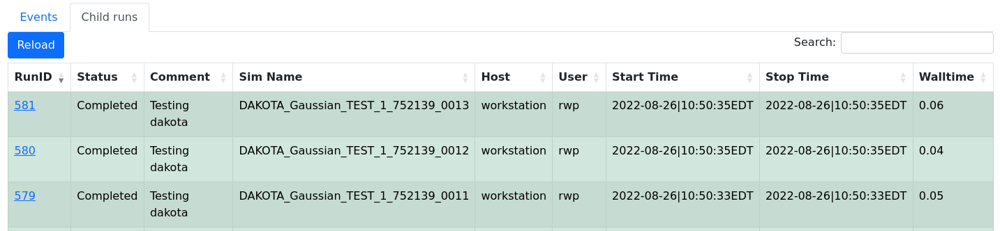
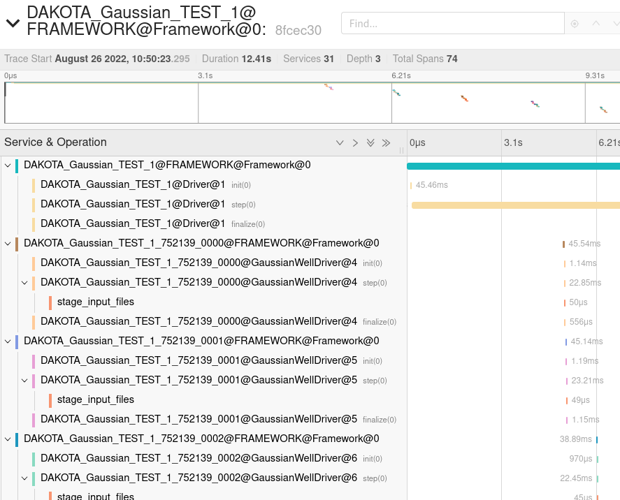

==========
IPS Portal
==========

The `IPS portal <http://lb.ipsportal.production.svc.spin.nersc.org/>`_
hosted on the `NERSC Spin <https://docs.nersc.gov/services/spin/>`_
service, shows the progress and status of IPS runs on a variety of
machines.  The simulation configuration file and platform
configuration file contain entries that allow the IPS to publish
events to the portal.

On the top-level page, you will see information about each run
including who ran it, the current status, physics time stamp, wall
time, and a descriptive comment.  From there you can click on a Run ID
to see the details of that run, including calls on components, data
movement events, task launches and finishes, and checkpoints.

To use the portal include

.. code-block:: text

   USE_PORTAL = True
   PORTAL_URL = http://lb.ipsportal.production.svc.spin.nersc.org

The source code for the portal can be found one `GitHub
<https://github.com/HPC-SimTools/IPS-portal>`_ and issues can be
reported using `GitHub issues
<https://github.com/HPC-SimTools/IPS-portal/issues>`_.

in either your :doc:`Platform Configuration File<platform>` or your
:doc:`Simulation Configuration File<config_file>`.

Tracing
-------

.. note::

   New in IPS-Framework 0.6.0

IPS has the ability to capture a trace of the
workflow to allow analysis and visualizations. The traces are captured
in the `Zipkin Span format <https://zipkin.io/zipkin-api/>`_ and
viewed within IPS portal using `Jaeger
<https://www.jaegertracing.io/>`_.

After selecting a run in the portal there will be a link to the trace:

The default view is the Trace Timeline but other useful views are
Trace Graph and Trace Statistic which can be selected from the menu in
the top-right:

The statistics can be further broken down by operation.

.. note::

   Self time (ST) is the total time spent in a span when it was not waiting on children. For example, a 10ms span with two 4ms non-overlapping children would have self-time = 10ms - 2 * 4ms = 2ms.

Child Runs
----------

.. note::

   New in IPS-Framework 0.7.0

If you have a workflow where you are running ``ips`` as a task of
another IPS simulation you can create a relation between them that
will allow it to be viewed together in the IPS-portal and get a single
trace for the entire collection.

To setup the hierarchical structure between different IPS runs, so if
one run starts other runs as a separate simulation, you can set the
``PARENT_PORTAL_RUNID`` parameter in the child simulation
configuration. This can be done dynamically from the parent simulation
like:

.. code-block:: python

  child_conf['PARENT_PORTAL_RUNID'] = self.services.get_config_param("PORTAL_RUNID")

This is automatically configured when running
``ips_dakota_dynamic.py``.

The child runs will not appear on the main runs list but will appear
on a tab next to the events.

The trace of the primary simulation will contain the traces from all
the simulations:

